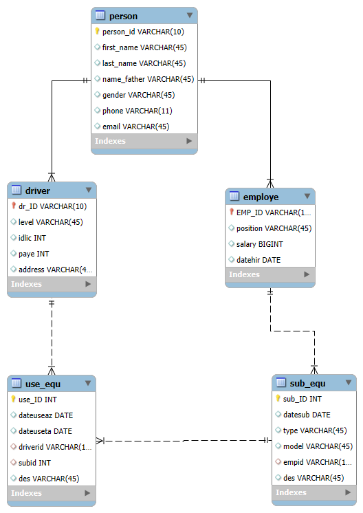

پروژه پایگاه داده باphp با قابلیت CRUD (مدیریت پارکینگ شهرداری)

برای اجرا پروژه پوشه PROJECT رو داخل وب سرور خودتون بریزید. ترجیحا اپاچی
پایگاه داده mysql هست. برای مدیریت بهتر و اضافه کردن بهتره با ابزار mysql workbench کار کنید.

نمودار ER:

